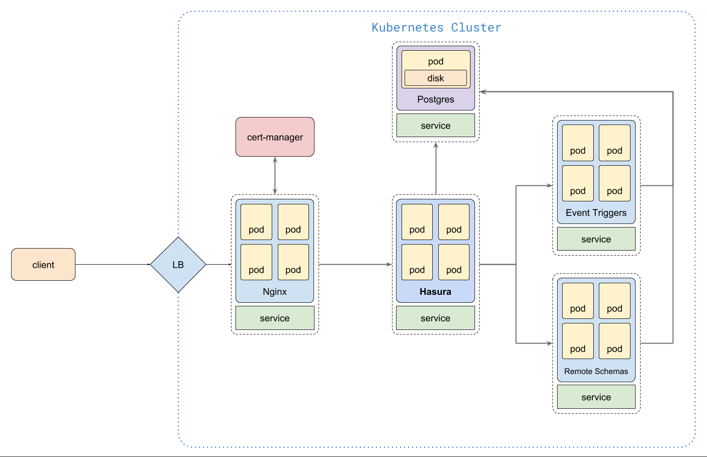

# hasura-k8s-stack

A feature-complete Hasura stack on Kubernetes.


## Components

- Postgres _(For production use cases, it is recommended to have a managed/highly available Postgres instance)_
- Hasura GraphQL Engine
- Nginx for Ingress
- Cert Manager for auto SSL with Let's Encrypt
- Remote Schema with Express.js and GraphQL.js
- Event Triggers with Express.js

## Architecture



## Setting up

_This guide is written with the assumption that the user is well versed with
Kubernetes and the user has a Kubernetes cluster with enough resources ready for
consumption._

### Postgres

[Postgres](https://www.postgresql.org/) is the primary datastore and is created
as a Kubernetes Deployment backed by a Persistent Volume. This is only intended
for a development setup and should not be used in a production scenario. If
there is no first-class storage support, Postgres should be outside the
Kubernetes cluster.

A Kubernetes Service object is created to direct traffic to Postgres pod in this
Deployment.

Kubernetes Secrets are used to store the Postgres username, password etc. Actual
secret files should never be committed to the repo.

#### Installation

```bash
cd postgres

# copy the secret.yaml file
cp secret.yaml secret.prod.yaml

# edit secret.prof.yaml and change username, password, dbname
vim secret.prod.yaml

# create the secret
kubectl apply -f secret.prod.yaml

# create the PVC
kubectl apply -f pvc.yaml

# create deployment and service
kubectl apply -f deployment-service.yaml
```

Once these components are successfully created, Postgres will be available at
`postgres://postgres:5432` on the Kubernetes cluster in the `default` namespace.

### Hasura GraphQL Engine

[Hasura GraphQL Engine](https://hasura.io) is deployed as a Kubernetes
Deployment along with a Service object to load balance traffic to multiple pods.
The default deployment launches one instance of GraphQL Engine connected to the
Postgres DB provisioned earlier.

#### Installation

```bash
cd hasura

# copy secret.yaml
cp secret.yaml secret.prod.yaml

# edit secret.prod.yaml and add an admin secret (access key) and db url
vim secret.prod.yaml

# create the secret
kubectl apply -f secret.prod.yaml

# create the deployment and service
kubectl apply -f deployment-service.yaml
```

Hasura should be available as `http://hasura:80` inside the cluster. This
service can be publicly exposed with an ingress rule and we'll explore it in the
ingress section.

#### Scaling

Hasura can be horizontally scaled without any side-effects. Just increase the
number of replicas for the Kubernetes deployment. Make sure that there is enough
CPU/RAM available for the new replicas.

```bash
kubectl scale deployment/hasura --replicas 3
```

#### Migrations

Hasura can keep track of the database and metadata changes and store them as
declarative files so that it can be version controlled. It is a flexible system
that let's you write migrations by hand or it can auto-generate migrations when
you use the console.

To use migrations, install the Hasura CLI - instructions are in the
[docs](https://docs.hasura.io/1.0/graphql/manual/hasura-cli/install-hasura-cli.html).

Once CLI is installed, open the console using CLI.

```bash
cd hasura

# open console
hasura console --endpoint <hasura-endpoint> --access-key <hasura-access-key>
```

As and when you use the console to make changes, CLI will write migration files
(yaml) to the `migrations` directory.

[Read more](https://docs.hasura.io/1.0/graphql/manual/migrations/index.html)
about migrations.

The same migrations can then be applied on another Hasura instance:

```bash
cd hasura

# apply migrations on another instance
hasura migrate apply --endpoint <another-hasura-endpoint> --access-key <access-key>
```

Until [PR#1574](https://github.com/hasura/graphql-engine/pull/1574) is merged,
it is recommended to scale the replicas back to one to apply migrations and then
scale them back up again.


### Nginx Ingress

[Nginx Ingress Controller](https://kubernetes.github.io/ingress-nginx/) let's us
define ingress rules and expose services running in the cluster on an external
domain. Behind the scenes, it is an Nginx container which can be configured
using Ingress objects to add specific routing rules. It can also do SSL
termination which we will be using along with cert manager.

#### Installation

```bash
cd nginx-ingress

# create namespace, configmaps and deployment
kubectl apply -f mandatory.yaml

# create the loadbalancer
kubectl apply -f cloud-generic.yaml
```

#### Ingress resource for Hasura

Now that the Ingress controller is created, we can create an Ingress object to
route external traffic to our Hasura container.

Before that, we need to configure a domain and add the load balancer's IP
address to the domain's DNS records.

```bash
# get load balancer ip
kubectl -n ingress-nginx get service

NAME            TYPE           CLUSTER-IP     EXTERNAL-IP    PORT(S)                      AGE
ingress-nginx   LoadBalancer   10.0.162.204   52.172.9.111   80:31186/TCP,443:30609/TCP   30h

# copy the EXTERNAL-IP
```

Once you have the `EXTERNAL-IP` from the output above, add an A record for your
domain from the DNS dashboard.

We'll use the same domain in our ingress configuration.

```bash
cd hasura

# edit ingress.yaml and replace k8s-stack.hasura.app with your domain
vim ingress.yaml

# create the ingress resource
kubectl apply -f ingress.yaml
```

Depending on the load balancer and the networking plugin, it will take couple of
minutes for the configuration to be active.

```bash
# check the status of ingress
kubectl get ingress

NAME     HOSTS                  ADDRESS        PORTS     AGE
hasura   k8s-stack.hasura.app   52.172.9.111   80, 443   30h

```

You can check the status by checking if the address is assigned. Once it is
available you can go to the domain and it should load the Hasura console.

### Cert Manager

[Cert Manager](https://github.com/jetstack/cert-manager) is a Kubernetes add-on
to automate the management and issuance of TLS certificates from various issuing
sources. We'll use it to provision certificates automatically from [Let's
Encrypt](https://letsencrypt.org/).

This step is optional if you have already bought certificates from another
vendor as it can be configured directly with the Ingress controller.

#### Installation

```bash
cd cert-manager

# create the namespace
kubectl apply -f namesapce.yaml

# create crds
kubectl apply -f 00-crds.yaml

# create the cert manager resources
kubectl apply -f cert-manager-yaml

# create letsencrypt staging and prod issuers
kubectl apply -f le-staging-issuer.yaml
kubectl apply -f le-prod-issuer.yaml
```

As soon as the manager starts running, it will contact the Let's Encrypt staging
server and issues a fake certificate. This is to make sure that
misconfigurations will not lead to hitting rate limits on the prod server.

Checkout of you're getting a SSL certificate for the domain (it will be invalid
as it is a fake CA). If everything is alright, edit the ingress resource to use
the prod issuer.

```bash
# open the ingress object in an editor
kubectl edit ingress hasura

# replace letsencrypt-statging to letsencrypt-prod
#    certmanager.k8s.io/issuer: letsencrypt-prod

# save and exit
```

The domain should have a proper SSL certificate once the issuance is completed.

### Event Triggers

[Event
triggers](https://github.com/hasura/graphql-engine/blob/master/event-triggers.md)
can be used to trigger webhooks on database events like insert, update and
delete. This is typically useful for executing asynchronous business logic, like
sending emails, updating a search index etc. In this stack we are using a
Node.js microservice written using Express.js which exposes our webhooks. Many
community contributed
[boilerplates](https://github.com/hasura/graphql-engine/tree/master/community/boilerplates/event-triggers)
are available which includes serverless functions also.

#### Installation

```bash
cd event-tiggers

# create kubernetes deployment and service
kubectl apply -f k8s.yaml
```

Once the container has started, the triggers will be available at
`http://event-triggers` from within the cluster, there is an echo trigger that
is already setup at `http://event-triggers/echo`.


### Remote Schema

To custom business logic that is synchronous in nature, you can write a
dedicated GraphQL server in any preferred language and expose the queries and
mutations from that server through Hasura's GraphQL API using [Remote
schema](https://github.com/hasura/graphql-engine/blob/master/remote-schemas.md)
feature. The stack here includes a GraphQL server written in Node.js using
Express.js and GraphQL.js with a sample Hello World schema.

#### Installation

```bash
cd remote-schema

# create kubernetes deployment and service
kubectl apply -f k8s.yaml
```

The GraphQL server should be available at `http://remote-schema/graphql` from within the cluster.

## TODO

- Using tools like [Kustomize](https://kustomize.io/) to make deploying easier.
- Setting up CI/CD scripts for migrations and environment promotion.
- Docs for auth integration.